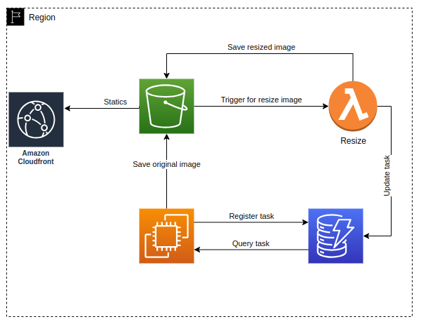

# Media API



## Description

This system was designed for storage images and resized using lambda functions.

## Technologies

* NodeJS
* AWS
    * EC2 for API
    * CloudFront
    * S3
    * DynamoDB
    * Lambda functions
* Docker
* Terraform


## Installation

```bash
npm install
```

## Running the app

```bash
# development
npm run start

# watch mode
npm run start:dev

# production mode
npm run start:prod
```

## Test

```bash
# unit tests
npm run test

# e2e tests
npm run test:e2e

# test coverage
npm run test:cov
```

## Infraestructure

### Build lambda.zip for upload
Build lambda function

```bash
# remove lambda.zip if exists
rm lambda.zip
cd lambda/
zip -r ../lambda.zip .
# return to base folder
# cd ..
```

### Deploy lambda infraestructure
```bash
# init
cd terraform/
terraform init
terraform validate
terraform plan
terraform apply
# return to base folder
# cd ..
```